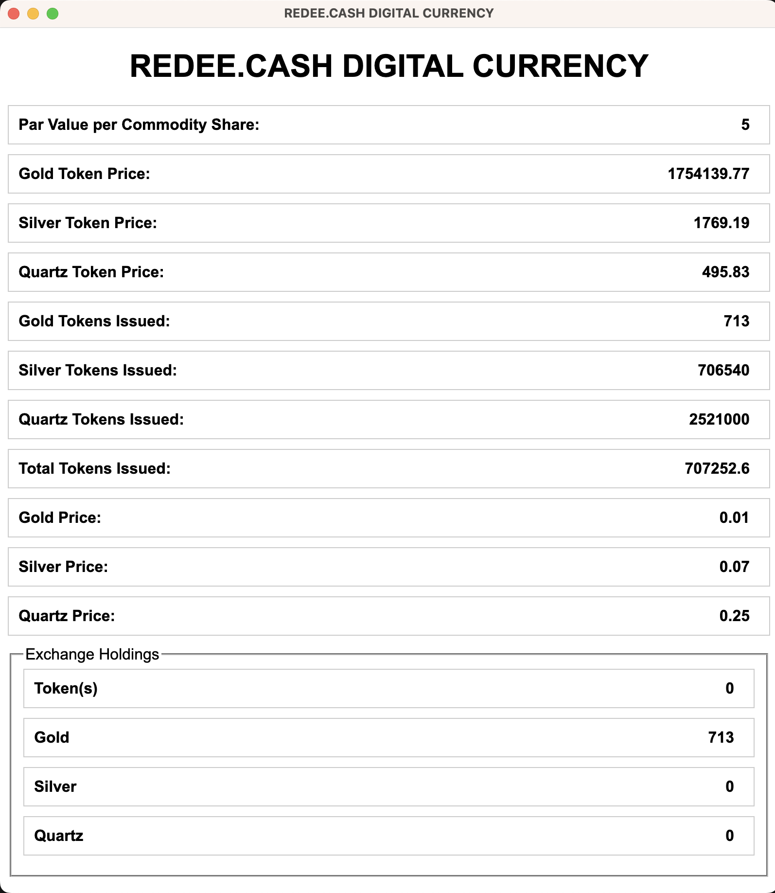

# REDEE.CASH - A Digital Currency Backed by the ~~Gold~~ Quartz Standard

Welcome to the future of digital currency! REDEE.CASH combines the convenience and security of digital transactions with the stability and intrinsic value of the ~~gold~~ quartz standard. It revolutionizes the way we transact and store value in the digital age.

## Key Features and Principles

Discover the benefits of REDEE.CASH:

- **~~Gold~~  Quartz Backing:** Each unit of REDEE.CASH is backed by physical ~~gold~~ quartz reserves, ensuring stability and confidence in its value.
- **Blockchain Technology:** Built on a secure and decentralized blockchain network, REDEE.CASH ensures transparency, immutability, and integrity of all transactions.
- **Efficient Transactions:** Send and receive funds quickly and at low cost, enabling seamless global trade and financial transactions.
- **Accessibility:** REDEE.CASH is designed to be accessible to everyone through user-friendly digital wallets, promoting financial inclusion.
- **Stability and Inflation Resistance:** The ~~gold~~ quartz standard provides stability, protecting REDEE.CASH from inflationary pressures and fostering long-term economic planning.
- **Auditability:** Regular audits of ~~gold~~ quartz reserves by reputable third-party organizations ensure the accuracy and reliability of REDEE.CASH's backing.
- **Regulatory Compliance:** REDEE.CASH is committed to adhering to applicable regulations and guidelines, establishing a secure and legal environment for users.

## Join the Future of Digital Currency

Experience the power of REDEE.CASH today! Whether you are an individual or a business, REDEE.CASH offers a reliable and stable currency that combines the benefits of ~~gold~~ quartz with the convenience of digital transactions. Embrace the future of finance and be part of the REDEE.CASH revolution.

Next Step: Obtain Regulatory/Judicial approval

## Whitepaper

[REDEE.CASH Whitepaper](files/whitepaper.pdf)

## Main Dialog

The dialog shows the token prices as well as the token issued with the ~~gold~~ quartz and silver quotes,

The Exchange Holdings are reserves when the metal prices fluctuate and less tokens are available than initially available, the excess will be held in the appropriate metals queue.
